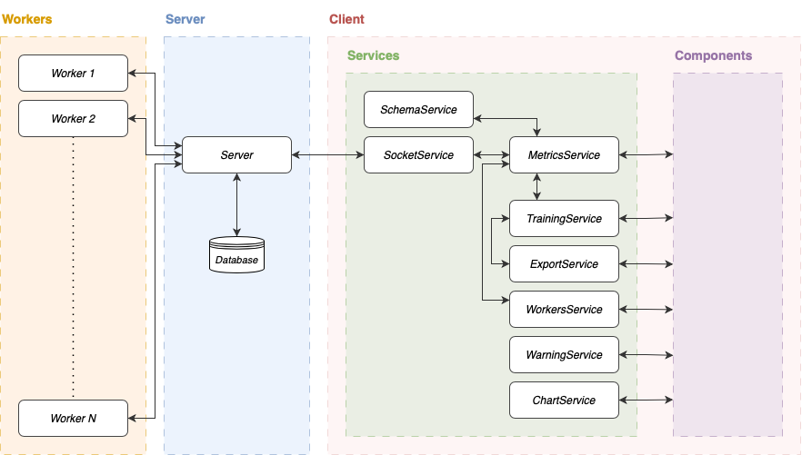
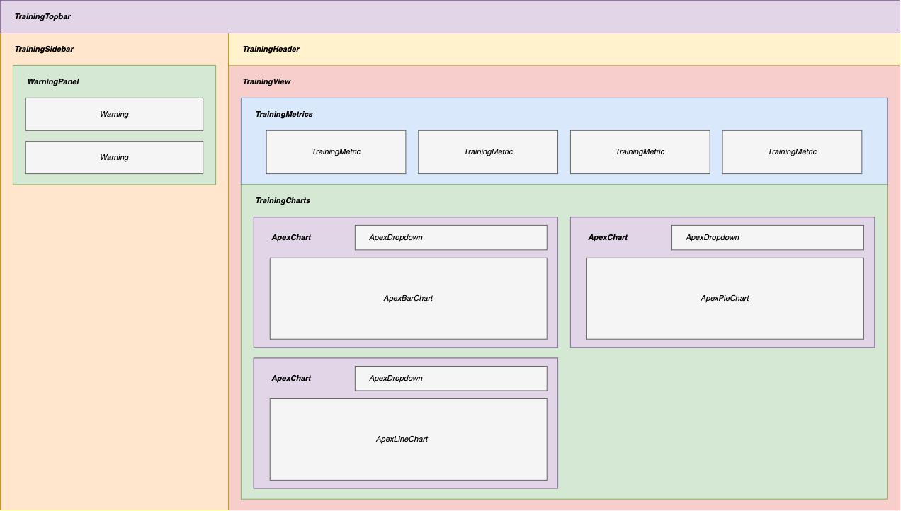
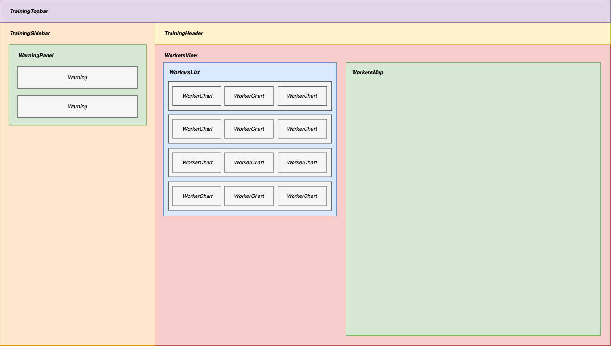

# Client

The TRAICE client provides a visualization of past and current training metrics using graphs and visual elements. This document describes the technical architecture of the Angular application in order to facilitate its modification or extension. The main elements of the application are the services and components, and the general behavior will be described as well as the interactions to facilitate overall understanding of the product.

## Services

Services manage application logic and communication with the server. The application contains 8 services, details of which are given below. The following diagram provides an overview of services and their interaction with other system elements.



### Socket - `SocketService`

This service manages the WebSocket connection with the server using the [Socket.IO](https://socket.io) library and is responsible for sending and receiving events. Event reception is mainly delegated to the `MetricsService`, which defines several handlers.

### Metrics - `MetricsService`

This service acts as a controller for data communication within the application. It implements an event subscription system, to which other components can subscribe. When an event occurs, its subscribers will receive updates with the specified content. This system is based on a schema mechanism that will be described in detail later. When a component subscribes to an event, it also receives past updates corresponding to the requested data. This service is also responsible for knowing the list of available metrics and properties that it will be possible to view or interact with.

The subscription system has several use cases. For example, graphs can subscribe to the event corresponding to the end of an epoch to receive new data and update the graph.

### Schema - `SchemaService`

This service implements a schema mechanism which is a strict indication of the form of a data structure, i.e. an object with certain properties. A schema is linked to a data source and enables information to be extracted in the form of the provided schema. For example, consider a data source and a schema :

```ts
const data = { a: 1, b: 2, c: 3 };
const schema = { d: 'a', e: 'b' };
```

When the data source is updated, the schema can be compared with the data source to see if the information can be extracted. In this case, the result is :

```ts
const update = { d: 1, e: 2 };
```

The method `fillSchema` takes a data source and a schema and tries to perform this merging process to return the filled schema.

-   **Nested keys** : schema properties can access nested keys of data using a dot `.` to split levels (e.g. `'a.b'` will access property `b` of object `a`)
-   **List of keys** : schema can extract data in array using a list of keys (e.g. `['a', 'b', 'c']` will map properties `a`, `b` and `c` of data)
-   **Nested schemas** : schema can contain another schema, allowing nested properties

```typescript
const data = { a: 1, b: { c: 2, d: 3 } };

// Nested keys
const schema = { e: 'b.c' }; // filled schema will be { e: 2 }

// List of keys
const schema = { e: ['a', 'b.d'] }; // filled schema will be { e: [1, 3] }

// Nested schemas
const schema = { e: { f: 'a', g: 'b.c' } }; // filled schema will be { e: { f: 1, g: 2} }
```

### Training - `TrainingService`

This service is responsible for managing and updating the object containing the training session information currently being visualized. It replicates the state of the object contained in the server, updating the object with the information received by the server during updates.

This service is also responsible for calculating additional metrics from other properties, such as the ratio of accuracy to CO2 emissions, or the difference in accuracy compared with the previous epoch.

### Export - `ExportService`

This service lets the user export the object containing all training information (general information, list of epochs, list of workers, etc.) in JSON format for later analysis or any other purpose.

### Workers - `WorkersService`

This service is designed as a central point of management for worker entities within the application. Its "workers" map allows dynamic updates and interactions with workers based on their id.

### Warnings - `WarningService`

This service manages warnings associated with every training. It maintains a map of warnings and their states for each training session. Additionally, it provides functionality to add, remove, and monitor warnings. When a warning's state reaches `CRITICAL`, it can trigger automatic actions, through the method `triggerAction`. The default behavior of this method is empty.

### Chart - `ChartService`

This service is responsible for several operations related to charts. In particular, it manages [ApexCharts](https://apexcharts.com) configurations for the various chart types, and links each chart type to a concrete Angular component. This service also enables the creation of new charts.

## Components

This section presents the general organization of the system's Angular components. There are 3 main views, which are described here along with diagrams showing the component hierarchy.

### List of trainings

This is the application's home page, showing a list of past and current training sessions. It consists solely of the `TrainingsListComponent` and `TrainingTopbarComponent` components, so no figure is required.

### Training (charts view)

Two views are available when visualizing a training session: one for viewing charts of the training session, and another for information on participating workers. The hierarchy of graphic view components is shown below.



### Training (workers view)

The hierarchy of workers view components is shown below.

